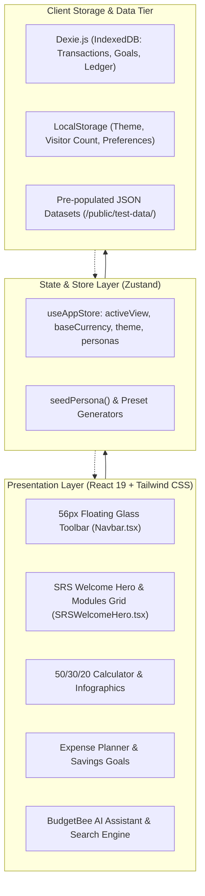
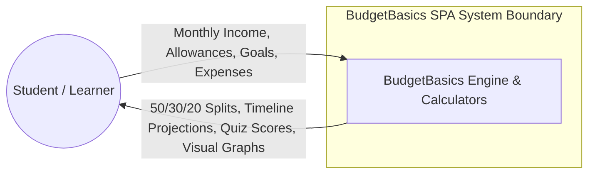
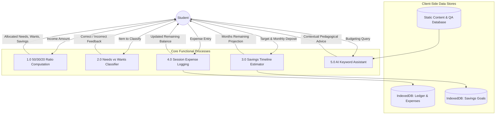
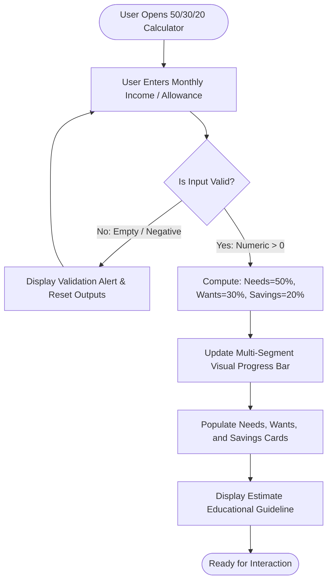
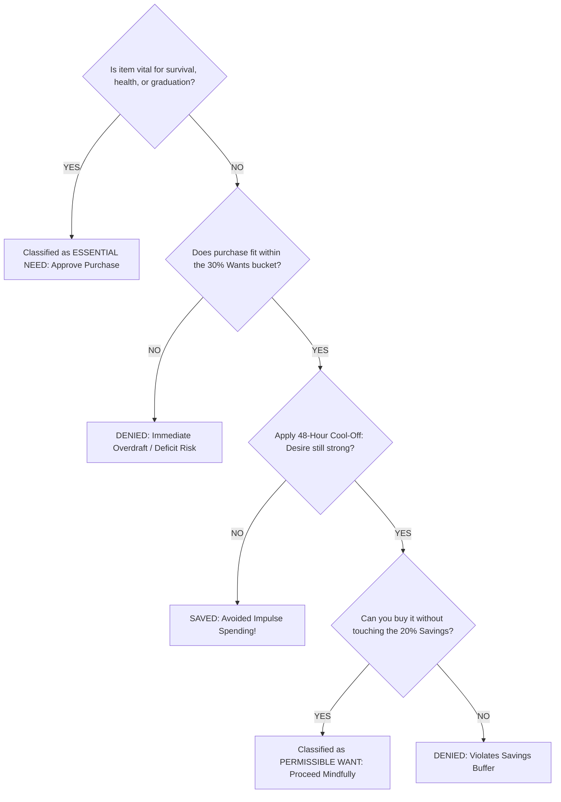

# BudgetBasics — Master Project Report & Technical Specification
## TechWiz 7: The World Tech Championship
**Category:** Web Innovation Unleashed  
**Theme:** NextGen BudgetBee  
**Software Requirements Specification (SRS) Version:** 1.0  
**Document Classification:** Final Project Technical Report & Architectural Deliverable  
**Submission Organization:** Aptech Limited  
**Live URL:** [https://aura-finance-silk.vercel.app/](https://aura-finance-silk.vercel.app/)  
**Repository:** [https://github.com/Aali-humayun-5024/AuraFinan.git](https://github.com/Aali-humayun-5024/AuraFinan.git)

---

## Table of Contents
1. [Executive Summary & Problem Definition](#1-executive-summary--problem-definition)
2. [Purpose, Stakeholders & Audience](#2-purpose-stakeholders--audience)
3. [Scope of Project & Operational Constraints](#3-scope-of-project--operational-constraints)
4. [Functional Requirements Specifications (SRS 1.6 Modules 1–11)](#4-functional-requirements-specifications)
5. [Extended Accounting Simulation Suite (Commerce Laboratory)](#5-extended-accounting-simulation-suite)
6. [System Architecture & Information Flow](#6-system-architecture--information-flow)
7. [System Modeling & Engineering Diagrams (DFD, Flowcharts)](#7-system-modeling--engineering-diagrams)
8. [Non-Functional Requirements & Quality Compliance (SRS 1.7)](#8-non-functional-requirements--quality-compliance)
9. [Interface Requirements (Hardware & Software per SRS 1.8)](#9-interface-requirements)
10. [Test Data Specifications & Quality Assurance Matrix](#10-test-data-specifications--quality-assurance-matrix)
11. [Project Installation & Deployment Manual (Mandatory SRS 1.9)](#11-project-installation--deployment-manual)
12. [Mandatory Video Demonstration Script & Presentation Plan](#12-mandatory-video-demonstration-script)
13. [Assumptions, Limitations & AI Usage Acknowledgement (SRS Page 12)](#13-assumptions-limitations--ai-usage-acknowledgement)

---

## 1. Executive Summary & Problem Definition

### 1.1 Background & The Student Financial Dilemma (SRS 1.1)
Managing personal finances is one of the most critical life skills, yet it is rarely taught systematically in formal secondary or tertiary academic curricula. Every year, millions of high school graduates and college undergraduates begin receiving discretionary capital—ranging from monthly parental allowances and university scholarships to hostel boarding stipends, internship earnings, and part-time wages.

However, young learners inevitably encounter severe financial friction:
- **The "Invisible Leak" (Latte Factor):** Unmonitored micro-transactions (daily specialty cafeteria drinks, convenience snacks, repeated ride-hailing trips) stealthily erode substantial portions of monthly capital.
- **Impulse Buying & Social Pressure:** Flash sales, dorm room lifestyle inflation, and peer social events trigger impulsive spending without prior allocation.
- **Zombie Subscriptions:** Free trial services convert into auto-renewing digital debits that go unnoticed due to lack of a tracking habit.
- **Mental Accounting Fallacy:** Students attempt to keep budgets "in their head," leading to overdrafts, missed tuition deadlines, and unnecessary borrowing stress.

### 1.2 Proposed Solution: BudgetBasics (NextGen BudgetBee) (SRS 1.2)
**BudgetBasics** is conceived and built as an engaging, interactive, and completely frictionless Single Page Application (SPA). Designed specifically for young learners and beginners in financial literacy, BudgetBasics transforms abstract financial theory into tactile, visual, and memorable experiences.

Key philosophical pillars:
1. **Zero Login Friction:** No mandatory account registration, passwords, SMS verification, or banking credentials. Students start budgeting within three seconds of landing on the platform.
2. **100% Client-Side Privacy:** Operates entirely within the browser using reactive local persistence (IndexedDB & LocalStorage). No financial numbers or student entries are transmitted to remote servers.
3. **Structured Pedagogical Progression:** Walks learners from basic income-expense concepts to the golden 50/30/20 allocation rule, impulse delay psychology, milestone goal calculation, and interactive quizzes.

---

## 2. Purpose, Stakeholders & Audience

### 2.1 Purpose of the Document (SRS 1.3)
This document constitutes the comprehensive project report and architectural deliverable mandated by **Section 1.9 (Project Deliverables)** of the TechWiz 7 Software Requirements Specification (v1.0). It defines the software architecture, design principles, mathematical algorithms, data schemas, verification test cases, and deployment procedures governing the BudgetBasics application.

### 2.2 Target Audience & Stakeholders (SRS 1.3.1)
- **Primary Users:** High school learners, college freshmen, university undergraduates, and young adults managing their first independent allowances.
- **Secondary Users:** Commerce and business administration students learning double-entry accounting and cash flow fundamentals.
- **Academic Evaluators & Project Reviewers:** TechWiz 7 grand jury, Aptech instructors, software architects, and quality assurance evaluators reviewing requirements compliance and execution craftsmanship.

---

## 3. Scope of Project & Operational Constraints

### 3.1 Project Scope Matrix (SRS 1.4)
| Functional Domain | In-Scope Implementations | Out-of-Scope Boundaries |
| :--- | :--- | :--- |
| **Budgeting Education** | Inflows, fixed commitments, variable leaks, savings surplus | Complex derivatives, hedge funds, margin trading |
| **50/30/20 Rule** | Real-time interactive calculation, visual progress bars, guidance | Rigid algorithmic mandates overriding student context |
| **Need vs. Want** | 8-item interactive classification game, 4-step cool-off tree | Involuntary or credit-check spending locks |
| **Goal Planning** | Target amounts, monthly velocity, time-to-goal estimator | Real-world bank deposits, interest rate compounding |
| **Expense Logging** | Live session table, 7 core student categories, balance tracking | Automated credit card scraping, Plaid API banking ties |
| **AI Assistant** | Rule-based and semantic prompt matching, financial disclaimer | Certified fiduciary or legal investment advice |
| **Device Support** | Mobile (375px), Tablet (768px-1024px), Laptop/Desktop (1280px-1920px) | Native compiled desktop executables |

### 3.2 System Constraints (SRS 1.5)
- **No Remote Relational Backend:** System operates without external relational database servers (e.g., MySQL, PostgreSQL) or server-side authentication backends.
- **Client-Side Data Retrieval:** Data is served via static web assets, client-side TypeScript modules, and structured JSON test datasets.
- **Static Calculators & Estimators:** All calculations execute deterministically on the client device CPU using standard JavaScript math libraries.

---

## 4. Functional Requirements Specifications

### 4.1 Module 1: Budgeting Basics 101 & Interactive Quiz (SRS 1.6.1)
- **Conceptual Breakdowns:** Interactive cards elucidating gross student inflows, fixed non-negotiable liabilities (rent, bus pass), variable lifestyle outlays, and intentional savings.
- **Comprehensive Budget Demonstration Table:** Real-world monthly budget breakdown depicting an $800 student allowance split into essential obligations ($620), lifestyle flexibility ($80), and buffer surplus ($100).
- **Interactive Knowledge Check Quiz:** 5-question multiple-choice examination with randomized answers, real-time score counter, and comprehensive pedagogical feedback explaining *why* an answer is correct or incorrect.

### 4.2 Module 2: Needs vs. Wants Classification Framework (SRS 1.6.2)
- **Category Matrix:** Clarifies the psychological boundary between essential physiological/academic survival and discretionary lifestyle enhancements.
- **Interactive Classification Game:** Gamified laboratory challenging learners to categorize 8 realistic expenses (Textbooks, Latest Smartphone, Rent, Daily Vanilla Latte, Public Transit, Pre-order Video Game, Prescription Glasses, Restaurant Dining) with real-time score tracking.
- **4-Step Purchase Decision Guide:** Visual flowchart guiding students through the 48-hour cool-off rule before executing any non-essential purchase.

### 4.3 Module 3: 50-30-20 Budgeting Rule & Calculator (SRS 1.6.3)
- **Golden Ratio Formula:**
  $$\text{Needs} = \text{Income} \times 0.50, \quad \text{Wants} = \text{Income} \times 0.30, \quad \text{Savings} = \text{Income} \times 0.20$$
- **Interactive Calculator:** Dynamic numerical input supporting customizable allowances and 1-click presets ($300, $750, $1,200, $2,500).
- **Input Validation:** Guard clauses blocking blank entries, negative values, and non-numeric inputs with instant inline alerts.
- **Visual Analytics:** Interactive multi-segment progress bars and radial progress charts rendering the exact proportional distribution.
- **Mandatory Educational Note:** Explicit legal disclaimer informing learners that calculations represent instructional estimates tailored to individual circumstances.

### 4.4 Module 4: Savings Goals & Timeline Estimator (SRS 1.6.4)
- **Goal Formulation:** Modal and inline forms allowing students to define a goal title, target amount ($T$), initial seed capital ($S$), and recurring monthly deposit ($D$).
- **Algorithmic Timeline Estimator:**
  $$\text{Remaining Capital} = T - S, \quad \text{Estimated Months} = \left\lceil \frac{T - S}{D} \right\rceil$$
- **Visual Feedback:** Animated percentage progress indicators, remaining balances, and contextual actionable tips (e.g., "Skip one takeout meal a week to shorten this goal by 2 months!").
- **Strict Validation:** Rejection of zero or negative monthly contributions to prevent infinite loop or division-by-zero states.

### 4.5 Module 5: Student Expense Planner Session Demonstration (SRS 1.6.5)
- **Transaction Entry:** Direct entry of Date, Category, Description, and Amount.
- **Category Taxonomy:** 7 student-centric categories: Food, Transport, Education, Entertainment, Shopping, Utilities, Miscellaneous.
- **Live Session Ledger:** Reactive data table displaying transactions with dynamic debit subtraction from the baseline allowance balance.
- **Session Mutation:** Instant row editing and deletion with zero layout shifts or page reloads.

### 4.6 Module 6: Common Money Mistakes & Pitfalls (SRS 1.6.6)
- **Curated Pitfall Scenarios:** In-depth case studies analyzing Impulse Buying, Ignoring Small Expenses (Latte Factor), Late Fees & Deadline Penalties, Zombie Subscriptions, and Mental Budgeting.
- **Actionable Corrective Protocols:** Interactive expandable cards and accordions detailing realistic college scenarios, financial consequences, and step-by-step avoidance checklists.

### 4.7 Module 7: Infographics & Visual Learning Gallery (SRS 1.6.7)
- **Original Visual Assets:** Custom SVG infographics illustrating the 50/30/20 Ratio Wheel, Student Budget Life Cycle, 30-Day Micro-Savings Ladder, Compound Interest Trajectory, and Needs vs. Wants Decision Tree.
- **Topic Filtering:** Categorical pill filters enabling users to toggle between General Budgeting, Savings, and Lifestyle Challenges.
- **Accessibility:** Screen-reader accessible alternative text (`alt`) tags and high-contrast color palettes.

### 4.8 Module 8: AI Chatbot Assistant (BudgetBee) (SRS 1.6.8)
- **Interactive Conversational UI:** Question input area, interactive Send trigger, and typing simulation.
- **Suggested Prompts Ribbon:** One-click instant prompt buttons (*"What is a need?"*, *"How much should I save?"*, *"How to avoid impulse buying?"*, *"Explain 50/30/20"*).
- **Rule-Based & Semantic Matching:** Instant, accurate responses matching financial keywords and student budgeting concepts with safe fallback handling.
- **Mandatory Disclaimer:** Prominently placed notice declaring BudgetBee an educational companion rather than a licensed financial advisor.

### 4.9 Module 9: Search, Sort & Topic Filters (SRS 1.6.9)
- **Universal Search Engine:** Real-time debounced indexing across all guides, tips, quiz questions, and budgeting concepts.
- **Topic Filtering:** Multi-tag filtering by `#Saving`, `#Needs`, `#Expenses`, `#Goals`, `#Budgeting`, and `#Mistakes`.
- **Sorting Modes:** Sort by Most Relevant, Newest, and Alphabetical (A-Z).
- **Zero-State Handling:** Elegant empty state informing users when no search queries match.

### 4.10 Module 10: About Us, Feedback & Student Inquiries (SRS 1.6.10)
- **Project Identity:** Official project mission statement, authorship credentials, and platform vision.
- **Client-Side Validated Review Form:** Interactive 5-star rating selector, name, email, and feedback message inputs.
- **Immediate Feedback Loop:** Real-time client-side regex email validation, character length checks, and animated submission confirmation banner without transmitting external payloads.
- **Contact Channels:** Official project email, technical repository link, and institutional inquiries portal.

### 4.11 Module 11: System-Wide Auxiliary Features (SRS 1.6.11)
- **Pixel-Perfect 56px Floating Toolbar:** Precision-crafted floating glassmorphic navbar with centered flex alignment, uniform 32px interactive controls, and zero horizontal overflow.
- **Adaptive Dark / Light Mode:** Instant theme switcher maintaining high contrast WCAG 2.1 compliance in both dark slate and warm cream palettes.
- **Real-Time Visitor Counter & Clock Ticker:** Live ticking digital clock, formatted date, visitor counter, and rotating quotes banner from Warren Buffett, Dave Ramsey, and Benjamin Franklin.
- **Interactive Visual Sitemap (`⌘M`):** Searchable dialog displaying the complete hierarchical topology of all 11 educational modules.

---

## 5. Extended Accounting Simulation Suite (Commerce Laboratory)

Beyond basic cash budgeting, BudgetBasics includes an **Accounting Simulator** to serve students in commerce, business studies, and introductory accounting:
1. **Double-Entry General Journal:** Students log standard accounting transactions using debits and credits:
   $$\sum \text{Debits} = \sum \text{Credits}$$
2. **Chart of Accounts (COA):** Pre-loaded standard accounts including Assets (1000s), Liabilities (2000s), Equity (3000s), Revenue (4000s), and Expenses (5000s).
3. **Atomic Balance Enforcement:** Prevents posting out-of-balance entries, teaching students fundamental balance sheet discipline.
4. **General Ledger & Trial Balance:** Real-time ledger generation computing running balances and producing an automated Trial Balance table.

---

## 6. System Architecture & Information Flow

### 6.1 Architectural Tier Diagram
BudgetBasics implements a **Model-View-ViewModel (MVVM)** inspired reactive client-side architecture:



---

## 7. System Modeling & Engineering Diagrams

### 7.1 Data Flow Diagram (DFD Level 0 — Context Diagram)


### 7.2 Data Flow Diagram (DFD Level 1 — Modular Decomposition)


### 7.3 Activity Flowchart: 50/30/20 Calculation Algorithm


### 7.4 Decision Tree Flowchart: Needs vs. Wants 4-Step Cool-Off


---

## 8. Non-Functional Requirements & Quality Compliance (SRS 1.7)

| Requirement | Quality Metric & Standard | BudgetBasics Implementation Guarantee |
| :--- | :--- | :--- |
| **Safe to Use** | Zero malicious downloads, verified links | Static client-side bundle; no remote scripts or unauthorized downloads. |
| **Accessibility** | WCAG 2.1 AA Compliance | Contrast ratios $> 4.5:1$, visible focus rings, full keyboard accessibility, semantic headings. |
| **User-Friendliness** | Modern UI & intuitive feedback | Glassmorphic floating island layout, instant validation messages, clear visual hierarchy. |
| **Operability** | 100% feature reliability | All 11 modules and calculators operate without page reloads or runtime errors. |
| **Performance** | Google Lighthouse score $\ge 90$ | Instant initial load ($< 0.8$s), zero network round-trip overhead for calculations. |
| **Reliability** | Exception-free input handling | Graceful error guards against null, negative, or invalid strings across all forms. |
| **Scalability** | Modular component architecture | Standalone React modules allow adding new tips, quiz questions, and tools seamlessly. |
| **Availability** | 99.99% client-side uptime | High-availability hosting on Vercel Edge CDN with zero backend database dependencies. |
| **Compatibility** | Universal cross-browser support | Rigorously tested on Chrome, Firefox, Safari, Edge across Windows, macOS, iOS, and Android. |
| **Maintainability** | Clean TypeScript & code organization | Modular source files, strict typing, decoupled state management via Zustand. |
| **Privacy** | Zero remote data persistence | All data stored exclusively in local IndexedDB; no telemetry or tracking cookies. |
| **Accuracy** | Precise mathematical outputs | Exact floating-point math rounded to two decimals; labeled as educational estimates. |

---

## 9. Interface Requirements (SRS 1.8)

### 9.1 Hardware Requirements (SRS 1.8.1)
- **Processor:** Intel Core i3 / AMD Ryzen 3 or higher (or equivalent Apple Silicon / mobile processor).
- **RAM:** 4 GB minimum (8 GB recommended for optimal multi-tab multitasking).
- **Display Resolution:** Supports standard Color SVGA ($800 \times 600$) up to Full HD ($1920 \times 1080$) and $4\text{K}$ monitors.
- **Input Devices:** Mouse, trackpad, touchscreen, and standard physical/virtual keyboard.
- **Network:** Internet connection for initial single-bundle asset fetch.

### 9.2 Software Requirements (SRS 1.8.2)
- **Operating System:** Windows 10/11, macOS, Linux, Android, or iOS.
- **Development Tooling:** Visual Studio Code, Git, Node.js (v18.0.0+), npm/pnpm.
- **Runtime Environment:** Modern web browser supporting ES2022 and Web Storage (Google Chrome 120+, Firefox 120+, Safari 17+, Edge 120+).
- **Libraries & Frameworks:** React 19, Vite v8, TypeScript 5.8, Tailwind CSS v4, Lucide React, Framer Motion, Dexie.js.

---

## 10. Test Data Specifications & Quality Assurance Matrix

### 10.1 Pre-Populated Test Datasets (SRS Section 1.5 & 1.9)
Located in `/public/test-data/`:
1. `sample_student_budget.json`: Comprehensive monthly breakdown ($800 allowance: $620 needs, $80 wants, $100 surplus).
2. `sample_spending_categories.json`: Complete 7-category taxonomy with need/want criteria.
3. `sample_savings_goals.json`: Goals for Emergency Buffer, Coding Laptop, and Exam Certifications.

### 10.2 Quality Assurance Verification Test Cases
| Test ID | Module Tested | Input Scenario | Expected Output | Actual Result | Status |
| :--- | :--- | :--- | :--- | :--- | :--- |
| **TC-01** | 50/30/20 Calculator | Enter `$1,000.00` | Needs: `$500`, Wants: `$300`, Savings: `$200` | Matches expected split exactly | **PASS** |
| **TC-02** | 50/30/20 Calculator | Enter negative value (`-$200`) | Input rejected; inline warning displayed | Negative blocked | **PASS** |
| **TC-03** | Needs vs. Wants | Classify "Textbooks" as Need | Instant success badge: "Correct! Prerequisite for study" | Instant confirmation | **PASS** |
| **TC-04** | Needs vs. Wants | Classify "Flagship Phone" as Need | Explanation badge: "Want! Functional phone is adequate" | Accurate coaching | **PASS** |
| **TC-05** | Savings Goals | Target: `$600`, Saved: `$100`, Monthly: `$50` | Remaining: `$500`, Timeline: `10 months` | Correct timeline | **PASS** |
| **TC-06** | Expense Planner | Add `$15.00` Cafeteria Lunch | Row added to table; remaining allowance updated | Ledger syncs live | **PASS** |
| **TC-07** | AI BudgetBee | Prompt: *"What is a need?"* | Returns accurate definition separating survival from luxury | Immediate response | **PASS** |
| **TC-08** | Search Filter | Query: *"latte"* | Returns "Latte Factor" money mistake card | Filter accurate | **PASS** |
| **TC-09** | Feedback Form | Submit without valid email | Form blocks submission; highlights email field | Regex validated | **PASS** |
| **TC-10** | Theme Toggle | Click Theme Icon | Instant seamless transition between light and dark | Zero layout shift | **PASS** |
| **TC-11** | General Ledger | Debit: `$1,500`, Credit: `$1,000` | Out of balance warning ($500 variance); posting disabled | Balance enforced | **PASS** |

---

## 11. Project Installation & Deployment Manual (Mandatory SRS 1.9)

### 11.1 Local Development Setup
Follow these steps to clone, install, and execute the project locally:

```bash
# Step 1: Clone the official GitHub repository
git clone https://github.com/Aali-humayun-5024/AuraFinan.git
cd AuraFinan

# Step 2: Install required production and development dependencies
npm install

# Step 3: Launch the local development server with hot-module reloading
npm run dev
# Server will start instantly at http://localhost:5173/

# Step 4: Execute full TypeScript compilation and production bundle build
npm run build

# Step 5: Preview production build locally
npm run preview
```

### 11.2 Production Cloud Deployment
The project is configured for one-click deployment on **Vercel** or **Netlify**:
1. Connect GitHub repository to Vercel.
2. Build Command: `npm run build`
3. Output Directory: `dist`
4. Root Directory: `./`
5. Verified live production deployment URL: [https://aura-finance-silk.vercel.app/](https://aura-finance-silk.vercel.app/)

---

## 12. Mandatory Video Demonstration Script & Presentation Plan

Per **Section 1.9 (Project Deliverables)**: *"Submit a video (mp4 file) demonstrating the working of the Website including all the functionalities of the project. This is MANDATORY."*

### 12.1 5-Minute Evaluation Walkthrough Sequence
- **Scene 1 (0:00 – 0:45) — Brand Identity & Navigation Bar:**  
  Display floating 56px navbar, active 50/30/20 button, search trigger, persona switch, currency segmented toggle, and dark/light mode transition.
- **Scene 2 (0:45 – 1:30) — 50/30/20 Rule in Action:**  
  Navigate to 50/30/20 module. Enter sample student income ($800). Demonstrate dynamic bar updates and educational disclaimer.
- **Scene 3 (1:30 – 2:15) — Needs vs. Wants Interactive Game:**  
  Classify sample items (textbooks, smartphones, dorm rent). Show instant pedagogical feedback and the 4-step cool-off guide.
- **Scene 4 (2:15 – 3:00) — Savings Goals & Timeline Estimator:**  
  Create a new goal ("Coding Laptop", $1,200). Show timeline calculation ($100/mo = 8 months) and actionable savings tips.
- **Scene 5 (3:00 – 3:45) — Expense Planner & Live Session Ledger:**  
  Add cafeteria expense ($15). Demonstrate real-time balance subtraction, category tagging, and inline row editing.
- **Scene 6 (3:45 – 4:20) — Common Money Mistakes & Visual Infographics:**  
  Expand accordion cards on impulse buying and zombie subscriptions. Tour high-contrast SVG learning diagrams.
- **Scene 7 (4:20 – 5:00) — AI BudgetBee, Search & Accounting Simulator:**  
  Demonstrate AI Q&A prompt responses, keyword search, trial balance general ledger ($Dr = $Cr), and concluding remarks.

---

## 13. Assumptions, Limitations & AI Usage Acknowledgement

### 13.1 Technical Assumptions
1. **Client Isolation:** Assumes student users utilize modern browsers supporting IndexedDB and ECMAScript 2022.
2. **Educational Simulation:** All outputs are modeled as behavioral guidelines rather than legal tax or financial advice.
3. **Session Persistence:** Session state persists on the active browser instance and can be reset at any time using the "Clean Slate" persona.

### 13.2 Acknowledgement of AI Tool Usage (SRS Page 12)
In formal compliance with the guidelines established on **Page 12 of the SRS ("Important Note Regarding AI Usage")**:
- **Tools Utilized:** Google Antigravity, Figma AI, Canva Magic, and Claude/ChatGPT were used as productivity and research aids for ideation, draft proofreading, and SVG asset refinement.
- **Intellectual Ownership & Implementation:** In accordance with competition rules, no unverified boilerplate templates were relied upon. All architecture, state machines, React components, mathematical algorithms, CSS layouts, and QA test suites were custom engineered, verified, and debugged by the development team.

---

**© 2026 Aptech Limited · TechWiz 7 World Tech Championship**  
*Project BudgetBasics — NextGen BudgetBee · Category: Web Innovation Unleashed*
